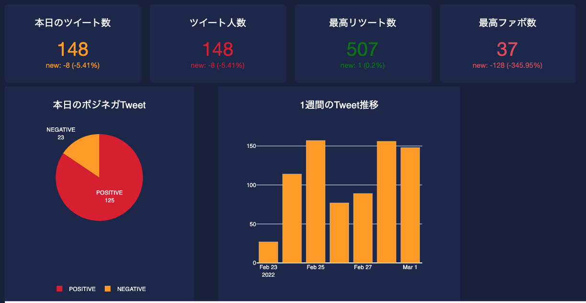

# Flaming Analysis　*炎上分析*
This repository is showing what is called 'Flaming Analysis'. 
This implementation allows us to observe the tweets including the name of company that is likely to be flaming on the internet

  

(these boxes above describe 'The number of Today tweets', 'The number of unique people who tweeted', 'The max retweet count', 'The max favorite count')

Installation instructions
-------------------------

The tested installation environment are MacOS(ver =< 11.5.1), Ubuntu(ver =< 20.04) or Amazon Linux(greater than t2.medium recommended). 
As premise the users have to register TwitterAPI account <https://developer.twitter.com/en/docs/twitter-api>. 
We also highly recommend to install MySQLWorkbench download from <https://www.mysql.com/products/workbench/>. 
Requisite packages are written in /bin/requirements.txt
* numpy==1.21.1
* tensorflow==2.7.0
* h5py==2.10.0
* youtokentome==1.0.6
* dash
* dash_table
* mysql-connector-python
* oauthlib
* requests
* requests-oauthlib
* boto3
* emoji
* <https://github.com/sugiyamath/sentiment_ja>
 
To install all of the above, it should be enough to run

    pip install -r requirements.txt

from the base directory of the package.

Initial Settings
-------------------------
Prior to runnnig the flaming analysis, 'db_initial_setting.py' needs to be implemented since it allows us to build initial MySQL DB tables including initial_day,day0~day6. 
Having got these tables, the system requires to acquire new extracted data from TwitterAPI from initial_day to day0 which can be implemented with 'main.py'. 
Note: When running 'main.py' as initial setting, the parameter named as 'initial_day' needs to be set 'True', otherwise it will return wrong results.

Main Analysis
-------------------------
To run main file you can simply run

    python main.py

Note: When running 'main.py' as initial setting, the parameter named as 'initial_day' needs to be set 'False', otherwise it will return wrong results. 
When making use of AWS EC2 instance, the steps of what this system does are broken down into few parts below 
* First, the system extracts tweet data having got the name of our company , that is ‘company name’, from API to insert them into AWS MySQL database .

* Then, The system analyses the stored data to categorise these into positive and negative tweets by AWS Comprehend which is cognitive analysis tool.

* After successfully getting done that, a NLP package called sentimentja (https://github.com/sugiyamath/sentiment_ja ) is to be implemented to categorise negative tweets into 5 kinds of sentiment that are happy, sad, disgust, surprise and angry. This method allows us to make the analysed data be more numerically detailed result. For instance ‘I am so happy’ could be happy=0.9, and the others are 0.

* Having got the data, the system compute risk values, whose range is 0(lowest) to 3(highest), by using the output of sentimentja. We actually created a function to evaluate the risk level.

* All of the processes will be implemented upon AWS EC2 instance that we built as an web application and it can finally visualise the sentimentally analysed data on Web browser as a form of Dash board .

Display Result
-------------------------
Once you get done runnnig main.py, you can browse the displayed result by runnnig

    python /py_dash/app.py
Now you can get Dash board on local IP which might be like http://125.****

# FlamingAnalysis
